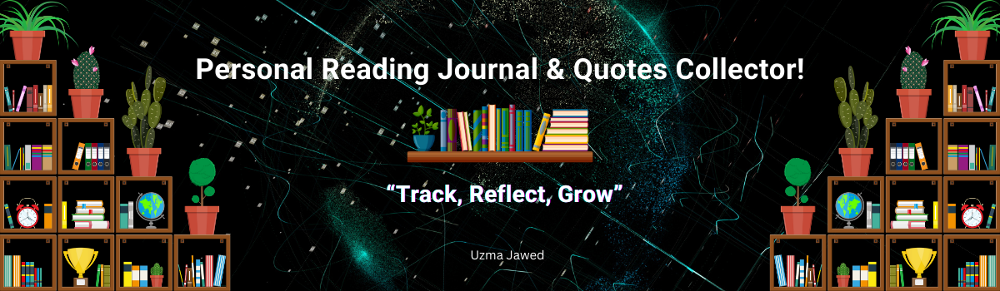

### 📚 Personal Reading Journal & Quote Collector

Welcome to **Read-n-Quote App** a personalized reading companion built using Python and Streamlit.  
Log books, collect your favorite quotes, and analyze your reading habits, all in one place!



---

### 🌟 Features

- ✍️ **Add, View & Manage Books** log details like title, author, genres, status, rating, and notes.
- 📖 **Quote Collector** store memorable quotes with book references, tags, and page numbers.
- 📊 **Reading Analysis** view stats like total books, favorite genres, most quoted book, and more.
- 🔐 **User Authentication** secure login and registration system (local only).
- 🧠 **Smart Filters & Sorting** find and organize books and quotes with ease.
- 🖼️ **Clean UI** designed with simplicity using Streamlit.

---

### Demo

> 🔒 Not deployed online yet.  
To try it locally, follow the steps below.

---

### 🛠️ Installation & Usage

### 🔧 Prerequisites

- Python 3.9 or above
- `pip` or a virtual environment like `venv` or `conda`

### 📦 Setup Steps

```bash
# Clone the repo
git clone https://github.com/Uzma-Jawed/read-n-quote-app.git
cd personal_reading_journal

# Create a virtual environment (optional but recommended)
python -m venv env
source env/bin/activate     # On Linux/macOS
env\Scripts\activate        # On Windows

# Install dependencies
pip install -r requirements.txt

# Run the app
streamlit run app.py

📁 Folder Structure

read-n-quote-app/
│
├── app.py                # Main Streamlit app
├── requirements.txt      # Python dependencies
├── banner.png            # Header image
├── profilepic.png        # Sidebar profile image
├── .gitignore            # Files/folders to ignore
├── data/                 # Local storage for user entries
│   ├── books.json
│   ├── quotes.json
│   └── users.json

⚠️ The data/ folder is ignored in .gitignore to protect personal entries.

💡 Future Improvements
🌐 Online deployment with user demo mode

🗝️ Password hashing for added security

📁 Export quotes and books to PDF or CSV

🎨 Dark mode and theming options

✍️ Creator
Uzma Jawed
Python Developer | AI & Data Science Student
🌐 LinkedIn:https://www.linkedin.com/in/uzma-jawed-21684728b | 💻 GitHub

📜 License
This project is open-source and available under the MIT License.


